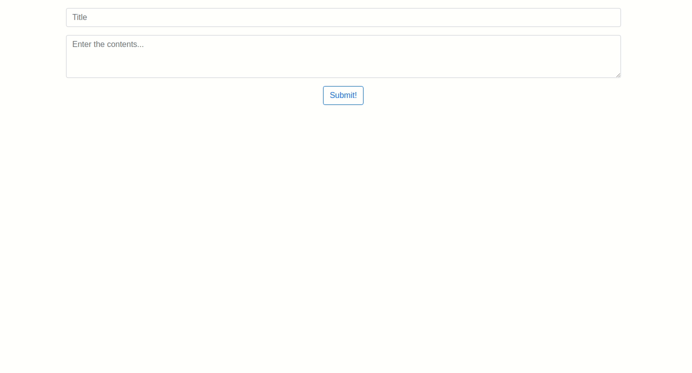

# Keep-Clone

It is a Google Keep clone

* Used HTML, JavaScript and Bootstrap library
* When the user clicks on submit, it creates a new card. Creating a new element using JavaScript and adding appropriate values to the element.
* When the user finishes a task, the user can press on the complete button to remove the task from the list. This will cause the particular element to be deleted from view. Used remove() method

